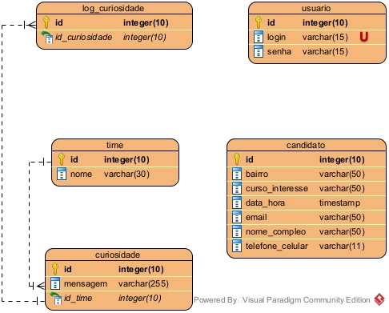

# Sistema Oráculo (Faculdade)

## Demonstração do Projeto
Confira todas as telas do sistema em funcionamento:
**[Clique aqui para assistir](https://youtu.be/KXWs8U0SOCM)**

## OBJETIVO
Este projeto foi desenvolvido como parte de uma avaliação acadêmica, com o objetivo de aplicar conceitos utilizando **Spring Boot**, **Spring Data JPA**, **Spring Web** e banco de dados relacional (**SQL Server**).

É um projeto Java Web criado com o **Maven**, que teve como propósito aprofundar o aprendizado em tecnologias que utilizei pela primeira vez, consolidando conhecimentos de arquitetura e persistência de dados.

## Modelagem e Arquitetura
Abaixo estão os diagramas que serviram de base para a construção do sistema, elaborados no **Visual Paradigm**:

### Diagrama de Classes

### Diagrama de Entidade e Relacionamento (DER)

## 🛠️ Tecnologias Utilizadas 
- **Java** (Linguagem principal)
- **Spring Boot** (Framework)
- **Spring Data JPA** (Persistência)
- **Spring Web** (Interface Web)
- **Maven** (Gerenciamento de dependências e build)
- **Bootstrap / CSS** (Estilização e interface)
- **SQL Server** (Banco de dados relacional)
- **Eclipse IDE** (Ambiente de desenvolvimento)
- **Visual Paradigm** (Modelagem de diagramas)
- **Git e GitHub** (Versionamento)

## 📖 Referências
- Documentação do Spring Boot
- Estilização e componentes: [Bootstrap](https://getbootstrap.com/)
- Consultas SQL e Procedures: Baseadas nas aulas de Laboratório de Banco de Dados e Banco de Dados - Fatec ZL.
- Curiosidades do times encontra-se aqui [Referências curiosidades - times](https://github.com/DaianeTararam/Av2LabBD-SistemaOraculo/blob/main/src/main/resources/txts/referencias.txt)

---
**Desenvolvido por Daiane Tararam**  
*Estudante de Análise e Desenvolvimento de Sitemas na Fatec ZL*
